# Laboratorio-3-Robotica
### Integrantes
#### Julian David Pulido Castañeda
#### Omar Armando Pérez Ospino

Acontinuacion se presentan las actividades realizadas en este laboarztorio cuyo objetivo era familiarizarnos con las herramientas que existen actualmente para el desarrollo de proyectos o procesos de robotica coordinados.

## Que es ROS2

ROS 2 (Robot Operating System 2) es la segunda generación de ROS, un framework de código abierto para el desarrollo de robots. Se creó para mejorar las limitaciones de ROS 1, proporcionando mayor seguridad, escalabilidad y compatibilidad con sistemas embebidos y en tiempo real.

<div align="center">
  
  <p>Figura 1. Logo ROS [1].</p>
</div>

### Características principales de ROS 2

##### Basado en DDS (Data Distribution Service)

<ul>  
<li> Mejora la comunicación entre nodos y permite comunicación distribuida sin necesidad de un nodo maestro (como en ROS 1).
<li> Facilita la integración con sistemas industriales y de misión crítica.
</ul>

#### Compatibilidad con Sistemas en Tiempo Real
<ul>  
<li>Soporta sistemas operativos RTOS (Real-Time Operating Systems) como FreeRTOS y QNX.
<li>Mejora la predictibilidad y confiabilidad de la ejecución.
</ul>  

#### Multiplataforma

<ul>  
<li>Soporta Linux, Windows y macOS de forma nativa.
<li>También puede ejecutarse en sistemas embebidos.
</ul>  

#### Gestión de Ciclo de Vida de Nodos

<ul>  
<li>Los nodos en ROS 2 tienen estados definidos para mejorar la administración y monitoreo de su ejecución.
</ul>  

#### Mayor Seguridad y Fiabilidad

<ul>  
<li>Incorpora mecanismos de autenticación y encriptación para la comunicación entre nodos.
</ul>  

#### Soporte para Microcontroladores (Micro-ROS)

<ul>  
<li>Permite ejecutar ROS 2 en microcontroladores de baja potencia como los basados en ESP32 o STM32.
</ul>  

### Diferencias clave entre ROS 1 y ROS 2

Característica	|	ROS 1	|	ROS 2	|
|	 ---	|	 ---	|	 ---	|
Comunicación	|	Basado en un nodo maestro	|	Basado en DDS (sin nodo maestro)	|
Soporte en Tiempo Real	|	Limitado	|	Mejorado con RTOS y QoS	|
Multiplataforma	|	Principalmente en Linux	|	Linux, Windows, macOS, embebidos	|
Seguridad	|	No incorporada por defecto	|	Seguridad y cifrado incluidos	|
Gestión de Nodos	|	No hay ciclo de vida de nodos	|	Nodos con gestión de ciclo de vida	|

### Distribuciones de ROS2

Actualmente existen 12 distribuciones de ROS2, de las cuales 3 siguen recibiendo soporte y 1 en desarrollo; en cuanto a ROS1 solo queda una version soportada, la cual busca dar transicion entre ROS1 y ROS2. La versiones nombradas como LTS o Long-Term Support, suelen ser la versiones recomendadas a instalar debido a que no solo son las mas estables sino que tambien las que siguen recibiendo soporte.

<div align="center">
  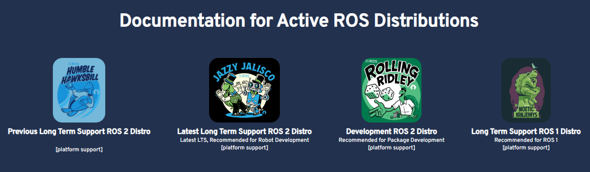
  <p>Figura 2. Distribuciones activas de ROS [1].</p>
</div>

|	Distribución	|	Fecha de lanzamiento	|	Fecha de fin de soporte (EOL)	|	Duración del soporte	|
|	---	|	---	|	---	|	---	|
|	Ardent Apalone	|	8 de diciembre de 2017	|	diciembre de 2018	|	1 año	|
|	Bouncy Bolson	|	2 de julio de 2018	|	julio de 2019	|	1 año	|
|	Crystal Clemmys	|	14 de diciembre de 2018	|	diciembre de 2019	|	1 año	|
|	Dashing Diademata	|	31 de mayo de 2019	|	mayo de 2021	|	2 años	|
|	Eloquent Elusor	|	22 de noviembre de 2019	|	noviembre de 2020	|	1 año	|
|	Foxy Fitzroy	|	5 de junio de 2020	|	junio de 2023	|	3 años	|
|	Galactic Geochelone	|	23 de mayo de 2021	|	noviembre de 2022	|	1.5 años	|
|	Humble Hawksbill	|	23 de mayo de 2022	|	mayo de 2027	|	5 años (LTS)	|
|	Iron Irwini	|	23 de mayo de 2023	|	noviembre de 2024	|	1.5 años	|
|	Jazzy Jalisco	|	23 de mayo de 2024	|	mayo de 2029	|	5 años (LTS)	|
|	Kilted Kaiju	|	23 de mayo de 2025	|	noviembre de 2026	|	1.5 años (LTS)	|
|	Rolling Ridley	|	junio de 2020	|	N/A	|	N/A	|

## Instalacion de ROS2

En primera instacia, cabe señalar que inicialmente las guias oficiales de instalacion de cualquier version de ROS, ya sea el 1 o el 2, exigian tener instalada alguna version de Linux compatible con la respectiva distribucion de ROS y realizar la instalacion en Linux. En los ultimos años, se ha dado la posibilidad de realizar la instalacion en Windows 10 y 11, gracias al aplicativo desarrollado por Microsoft, Windows Subsystem for Linux o WSL el cual permite correr una maquina virtual basica con alguna de las distribuciones de Linux recomendada, a su vez que correr ROS sobre esta.

<div align="center">
  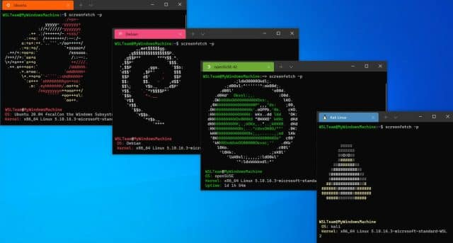
  <p>Figura 3. Ejemplo WSL con varias distribuciones de Linux [2].</p>
</div>

Como se puede ver, el uso de WSL implica el uso mas recursos y la instalacion directa con Linux requiere saber manejar particones e instalacion de sistemas operativos, por lo cual se opto por la opcion de realizar la instalacion mediante RoboStack, una serie de distribuciones tanto de ROS1 como ROS2 que usa el gestor de paquetes Conda como ambiente de ejecucion con el fin de no solo permitir la facil instalacion de ROS en sistemas diferentes de Linux sino tambien eliminar la dependendencia de usar maquinas virtuales, lo que tambien mejora el rendimiento de ROS.

<div align="center">
  
  <p>Figura 4. Logo RoboStack [4].</p>
</div>

<div align="center">
  
  <p>Figura 5. Windows 10.</p>
</div>

En busca de facilitar el laboratorio, se uso la instalacion de **RoboStack** para **Windows 10**, el cual dispone de 2 distribuciones de ROS2 (Humble Hawksbill y Jazzy Jalisco) y 1 distribucion de ROS1 (Noetic Ninjemys). Para realizar la instlacion se siguieron las intrucciones dadas en la Pagina de [RoboStack](https://robostack.github.io/GettingStarted.html). En primera instancia, es necesario instalar el gestor de paquetes Conda, si aun no esta instalada. Para eso necesita inicialmente necesitamos Miniforge3 para instalar mamba. En la propia pagina de RoboStack se proporciona vinculo a la pagina de [Conda-Forge](https://conda-forge.org/) para descarga su instalador para sistemas Windows.

<div align="center">
  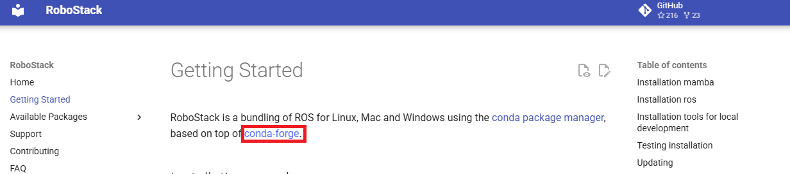
  <p>Figura 6. Pagina RoboStack y vinculo para descarga Miniforge3.</p>
</div>

Buscamos el instalador **Miniforge3-Windows-x86_64.exe** , lo ejecutamos y procedemos a la instalacion. Cabe señalar que el Miniforge3, se instalara por defecto en una carpeta vacia con el mismo nombre en la raiz del usuario, se recomienda no modificar esta direccion o si se hace elegir una carpeat que este completamente vacia para realizar la instalacion.

<div align="center">
  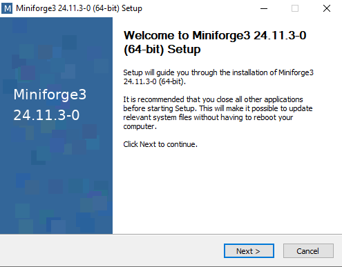
  <p>Figura 7. Instalador MiniForge3.</p>
</div>
<div align="center">
  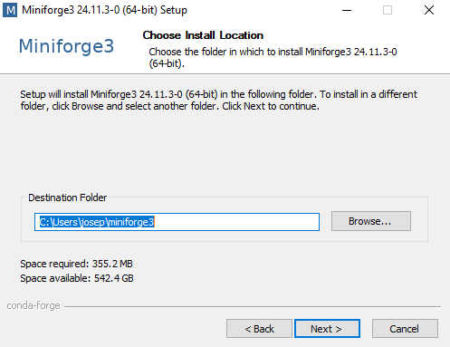
  <p>Figura 8. Direccion de la instalacionde Miniforge3.</p>
</div>

Un punto muy importante de estea instalacion, que se debe marca la casilla de incluir Miniforge3 en PATH de variables de entorno, independiente si el instalador dice que es una opcion no recomendada, debido a que sin esto no se prodan usar los comandos de Miniforge3 ya que el sistema no sabra donde buscarlos.

<div align="center">
  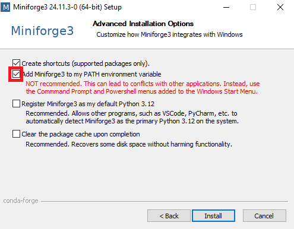
  <p>Figura 9. Habilitacion PATH para Miniforge3.</p>
</div>

Finzalizada la instalacion de Miniforge3, abrimos una terminal CMD con permiso de administrador y ejecutamos el siguientes comando:

```bash
conda install mamba -c conda-forge
```

Este comando descarga e instalara el gestor de paquetes mamba, toca estar atentanto ya que se pedira autorizacion de instalacion finalizada la descarga de los paquetes necesarios para la instalacion, para confirma la instalacion se debe escribir la letra **Y** de Yes y pulsar la tecla **Enter** para confirmar la instalacion. Posterior, se debe crear y configurar la carpeta donde se va ha instalar la distribucion de ROS, para eso ejecutamos el sisguiente paquete comandos:

```bash
mamba create -n ros_env python=3.11
mamba activate ros_env
conda config --env --add channels conda-forge
conda config --env --add channels robostack-staging
conda config --env --remove channels defaults
```

En este paquete de comando se crea el entorno **ros_env** en Conda, donde se ejecutara la distribucion de ROS, ademas de instalar la version especifica de Python necesaria para ejecutar ROS ene le entorno. Posterior, se procede a realizar la isntalcion de ROS2, cabe señalar que por cada distribucion de ROS que dispone RoboStack el comando de instalacion cambia, disponiendo de:

<ul>  
<li> El comando para instalar ROS1 Noetic Ninjemys es el siguiente:
</ul>

```bash
mamba install ros-noetic-desktop
```

<ul>  
<li> El comando para instalar ROS2 Humble Hawksbill es el siguiente:
</ul>

```bash
mamba install ros-humble-desktop
```

<ul>  
<li> El comando para instalar ROS2 Jazzy Jalisco es el siguiente:
</ul>

```bash
mamba install ros-jazzy-desktop
```

En nunestro caso, se opto por instalar **ROS2 Humble Hawksbill** al ser la version mas estable de ROS2 que dispone RoboStack. 

<div align="center">
  
  <p>Figura 10. ROS2 Humble Hawksbill [1].</p>
</div>

Cabe aclarar que si se quiere instalar ROS2 Jazzy Jalisco, el paquete de comandos para crear el entorno **ros_env** para Jazzy Jalisco es el siguiente:

```bash
mamba create -n ros_env python=3.11
mamba activate ros_env
conda config --env --add channels conda-forge
conda config --env --add channels robostack-staging
conda config --env --add channels robostack-jazzy
conda config --env --remove channels defaults
```
El procedimiento de instalacion de **ROS2 Humble Hawksbill** empezara con la descarga de todos los paquetes que encesita ROS2, posterior se pedira autorizacion de instalacion finalizada la descarga de los paquetes, para confirma la instalacion se debe escribir la letra **Y** de Yes y pulsar la tecla **Enter** para confirmar la instalacion. Este proceso puede suele ser algo lento, por lo cual se puede dar el caso de que la instlacion se vea interrumpida, en caso de ocurrir se puede volver a ejecutar el comando de instalacion y este buscara reanudar la instalacion en el mismo punto despues de verificar que se disponene de todos los paquetes. Finalizada la instlacion procedemos a reinicirar el el entorno **ros_env** mediante los siguientes comandos:

```bash
mamba deactivate
mamba activate ros_env
```

De esta forma completando la instlacion de **ROS2 Humble Hawksbill** , y cada vez que se quiera iniciar ROS2 se debe abrir una terminal CMD como administrador y ejecutara el comando:

```bash
mamba activate ros_env
```

y se apagara con el comando:

```bash
mamba deactivate
```
<div align="center">
  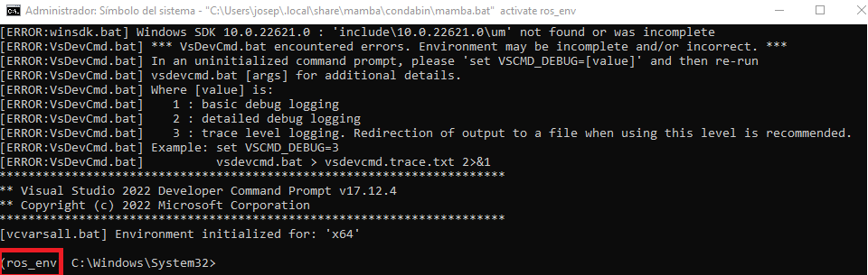
  <p>Figura 11. ROS2 Activo.</p>
</div>

Se sabe que ROS2 esta activo si al incio de la linea de comando aparece **ros_env** <, omo se puede ver en la figura 11 y desactivado cunaod no aparece. Activo ROS2, podemos realizar la instalacion de otra serie de paquetes complementarios para que ROS2 pueda interactuar con otros programas como Visual Studio entre otros para el desarrollo de aplicacions locales, por lo general se ejecuta el siguiente comando:

```bash
mamba install compilers cmake pkg-config make ninja colcon-common-extensions catkin_tools rosdep
```

El cual instala todas las herramientas necesarias. El caso de la vinculacion con Visual Studio, el comando dependera de la version de Visual Studio que se disponga en el equipo. RoboStack solo es complatible con versiones de Visual Studio 2017, 2019 y 2022 con soporte para C++. Los caomandos para instalar estas dependencias son:

<ul>  
<li> Para Visual Studio 2017 es:
</ul>

```bash
mamba install vs2017_win-64
```

<ul>  
<li> Para Visual Studio 2019 es:
</ul>

```bash
mamba install vs2019_win-64
```

<ul>  
<li> Para Visual Studio 2022 es:
</ul>

```bash
mamba install vs2022_win-64
```

En caso de requerir actualizar el entorno **ros_env**, ejecutamos el comando `mamba update --all`. Por ultimo, para probar que ROS2 quedo correctamente instalado se recomienda desplegar alguna de las herramientas que se disponen, se recomiendo ejecutar la herramienta ROS Visualization Tool o rviz2 debido a que es una de la mas importantes en el entorno de ROS engeneral, esto se realiza en el entorno activo de **ros_env** y con el comando:

```bash
rviz2
```
<div align="center">
  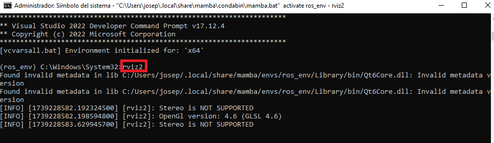
  <p>Figura 12. Ejecucion rviz2.</p>
</div>

<div align="center">
  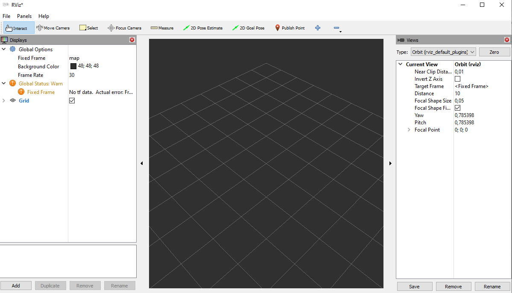
  <p>Figura 13. Interfaz rviz2.</p>
</div>

Algunas dificultades de instalacion que tuvimos fueron que se uso el pauquete de comandos para crear el entorno para ROS2 Jazzy Jalisco y se instalo ROS2 Humble Hawksbill, y ROS2 no se ejcutaba de forma optima, lo que ocasianando que se eliminar ROS2 y realizar la instlacion correcta. Otra situacion, es que que ROS2 se activo pero no reconozcio los comandos o herramientas ingresados, se reinicio ROS2 varias veces para ver si era un problema de inicializacion y si no funcionaba se actulizaban todos los paquets del entorno y se reinciba ROS2, posterior los comandos ya funcionaban

## Vinculacion ROS2-Matlab

En primera instancia activamos ROS2, y posterior ejecutamos el comando:

```bash
ros2 run turtlesim turtlesim_node
```
Este comando nos depslegara una demo de una tortuga, la cual puede ser controlada accediedno a ella como un nodo de ROS2.

<div align="center">
  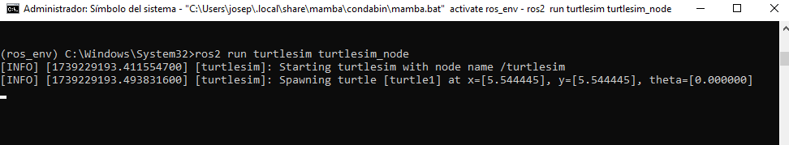
  <p>Figura 14. Comando TurtleSim.</p>
</div>

<div align="center">
  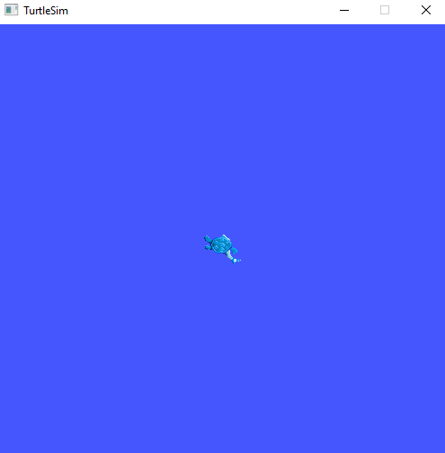
  <p>Figura 15. TurtleSim.</p>
</div>

Posterior se abre Matlab, se busca si las toolbox Robotics System Toolbox y ROS Toolbox estan instaladas, sino se procede a instalarlas. Posterior, se crea un script para ejcutar los siguienets comandos:

```Matlab
%% Crear nodo en ROS 2
ros2node = ros2node("matlab_node"); 

%% Crear publicador en ROS 2
velPub = ros2publisher(ros2node, "/turtle1/cmd_vel", "geometry_msgs/Twist");

%% Crear mensaje de velocidad
velMsg = ros2message(velPub);

%% Configurar velocidad (1 m/s en X)
velMsg.linear.x = 1;

%% Enviar mensaje
send(velPub, velMsg);
pause(1);
```

<ul>  
<li> Ejercicios iniciales realizados con scripts de Matlab y/o Python y/o comandos de ROS, mostrando los videos de sus resultados: viewer de ROS, Rviz, ventanas de Matlat y/o Simulink.
<li> Uso de Dynamixel Wizard: par´ametros de motor utilizados, comandos, resultados en fotos y/o videos
</ul>

## Uso de Dynamixel Wizard 2.0

Para verificar el estado de los motores marca Dynamixel, se utiliza el software de la misma empresa Dynamixel Wizard 2.0. Éste se puede descargar en la página del [e-Manual de ROBOTIS](https://emanual.robotis.com/docs/en/software/dynamixel/dynamixel_wizard2/). Para el caso de Windows, la instalación se realiza por medio de un archio ejecutable que contiene los archivos necesarios del programa.

<div align="center">
  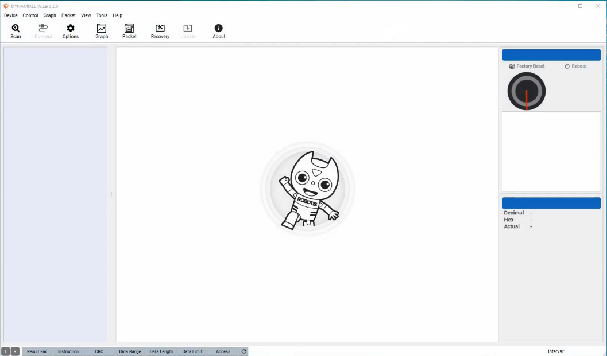
  <p>Figura *. Interfaz de Dynamixel Wizard 2.0.</p>
</div>

Posteriormente, se debe conectar el robot al computador por medio de USB. Es necesario indicarle al programa el puerto en el cual están conectados los motores. Para ello se debe ir a Options > Scan y seleccionar el puerto que el programa deberá escanear para reconocer los motores (figura *).

<div align="center">
  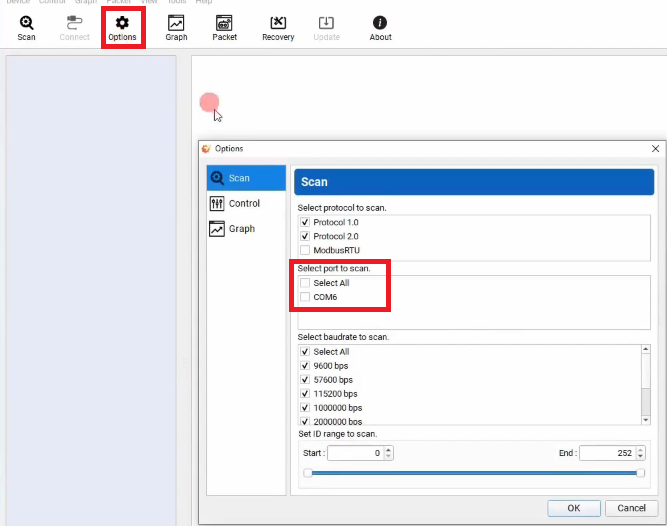
  <p>Figura *. Selección de puerto a escanear en Dynamixel Wizard 2.0.</p>
</div>

Una vez realizado el proceso de selección del puerto, se procede a hacer el escaneo de los motores, para ello se debe seleccionar Scan (figura *), se abrirá una vista en la parte central de programa, en donde habrá una barra de carga. A lo largo del proceso deben aparecer los motores del robot tanto en la ventana de escaneo como en el menú que se encuentra en la parte izquierda de la interfaz.

<div align="center">
  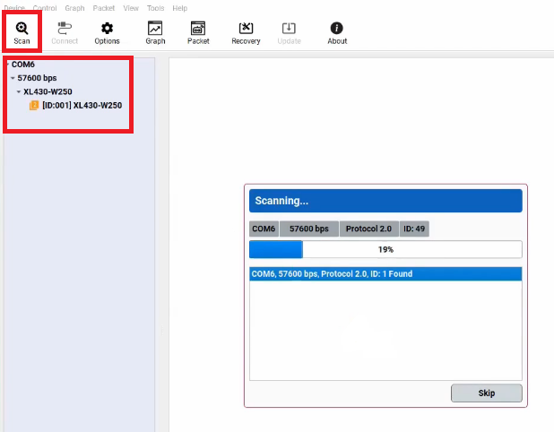
  <p>Figura *. Escaneo de motores en Dynamixel Wizard 2.0.</p>
</div>

Luego de escaneados los motores, es posible seleccionar cada uno y modificar sus parámetros (figura *), además, con el dial de la parte superior derecha, es posible modificar directamente la posición del servo. En el laboratorio se modificaron parámetros como el torque máximo y la velocidad máxima.

<div align="center">
  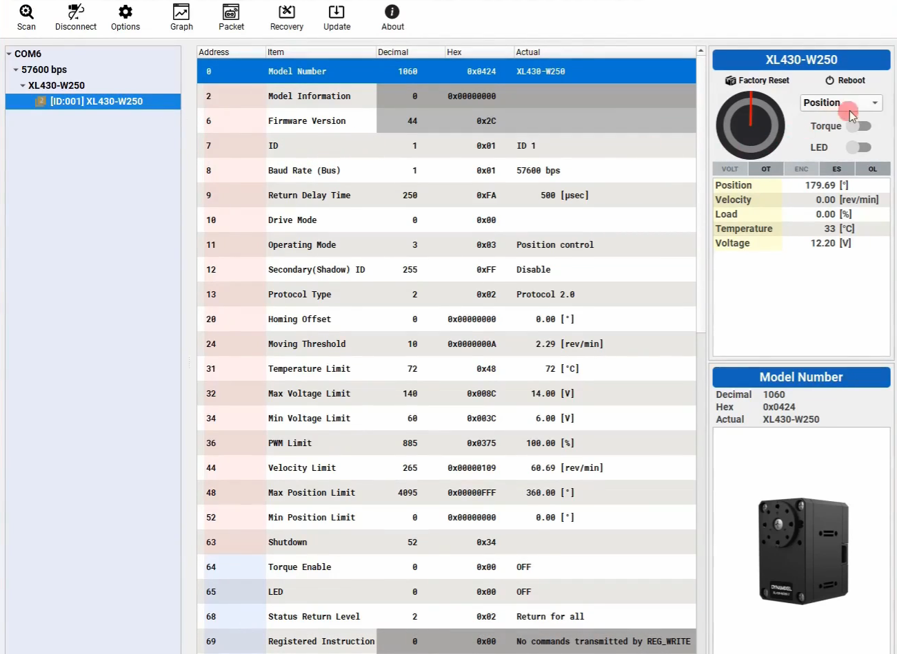
  <p>Figura *. Modificación de parámetros de los motores en Dynamixel Wizard 2.0.</p>
</div>

# Referencias

[1] Open Robotics, Documentación de ROS. 2025. Consultado el 6 de Febrero de 2025. [En linea]: https://docs.ros.org/

[2] Wayne Williams. Windows Subsystem for Linux (WSL) hits version 1.0.0. .2022. [En linea]:https://betanews.com/2022/11/16/windows-subsystem-for-linux-wsl-1/

[3] Open Robotics. ROS 2 Documentation. 2025. Consultado el 6 de Febrero de 2025. [En linea]: https://docs.ros.org/en/humble/index.html#

[4] Robostack. Robostack. 2025. Consultado el 6 de Febrero de 2025. [En linea]: https://robostack.github.io/
